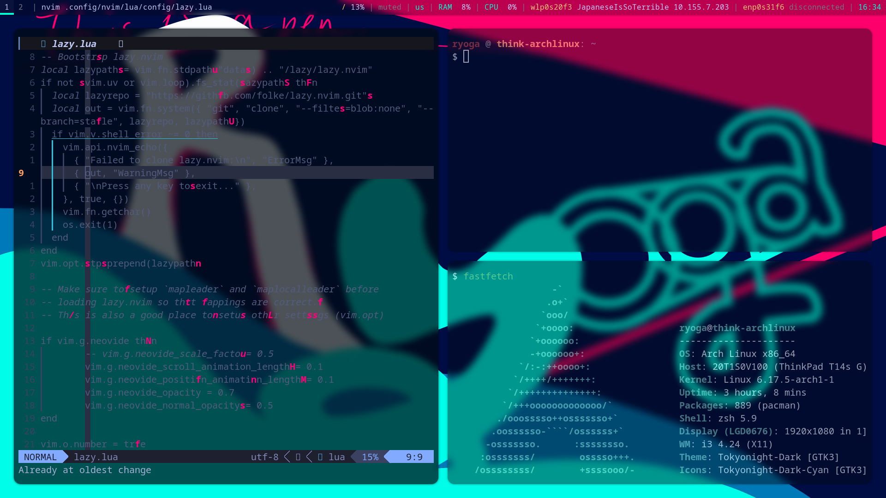
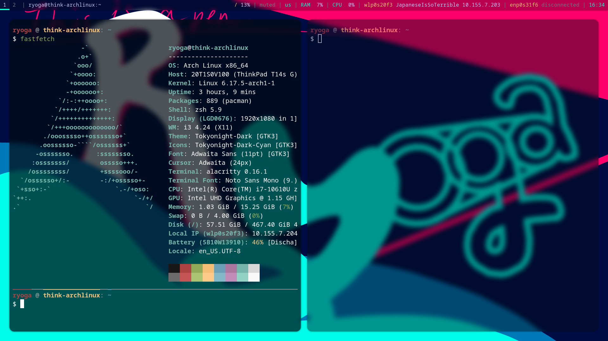

# My Personal Dotfiles
This is just for my personal configuration management.
I am using Chezmoi to manage my dotfiles, so files which start with `.` are replaced with `dot_`.


## Requirements
I use Arch, and packages I have installed are written in `pkglist.txt` for packages of the official repos, and `aurlist.txt` for AUR packages.
I sometimes generate those files by executing,

```
pacman -Qqen > pkglist.txt
pacman -Qqem > aurlist.txt
```

## Setting Up
適当にやればできるんですが、以下自分が新しいPCの環境を構築するときにやる流れを書きます。
やってたことを、なんとなく思いだして書いているだけなので、真似しないでください。
1. Install Arch Linux.
2. Configure networks, etc.
3. Install packages written in `pkglist.txt`.
4. Execute `chezmoi init RyogaHC && chezmoi apply`.
5. Execute `sudo systemctl enable lightdm && sudo systemctl set-default graphical.target && reboot`.
6. Execute `sudo systemctl --user enable syncthing`, and configure properly.
7. Copy `.git-*` and `.ppng-path` from my Syncthing folder into `~`.
8. 細かいとこいろいろやる。

## Other Screenshots of my i3

The left window is Neovim.

Fastfetch

## 工夫したポイント(自分の思想)
- 見た目を重視した。
- シンプルで無駄がないほど美しい(This is the main reason I use Arch)。情報量のムラがあると美しくない。
- 思い切って、フォーカスしたウィンドウを含むボーダーをなくした。その代わりに、フォーカスしてないウィンドウを透過した。
- 角を丸めるときの半径を大きめにした。そうすると、そのままだとターミナルの角があれだから、Alacrittyの設定で余白を設けた。
- ぼかしは結構使える。ぼかすと、情報量が減るというか、見た目シンプルになる(角丸も同じ理由)。
- i3に大きめの余白(gaps)を与えるのも、情報が集中しなくなってスッキリするから。
- Hyprlandのときみたいにウィンドウのアニメーションはほとんどないが、これはこれでシンプルでいい。
- Waylandは自分の好みじゃなかったからやめた(X11のサーバとクライアントで独立している設計が好きだったし、柔軟性がありそうな気がする)。

## 改善の余地(TODO, Priority: Low)
- 通知を表示できるように設定し、見た目をカスタマイズする。
- RofiがPicomに非アクティブウィンドウとして認識されているため、Picomの設定からruleを設定する。(簡単)
- Rofiが角丸によって変な見た目になってる。
- Rofiの見た目を変える。
- Rofiでもいいけど、Fuzzel(Wayland)みたいな曖昧検索のランチャーに移行するのもあり。
- Polybarをもっとスッキリさせる。
- 将来的にNixOSやAwesomeWMに移行するのもあり。GuixはNixOSほどメジャーじゃないため、やめる。
