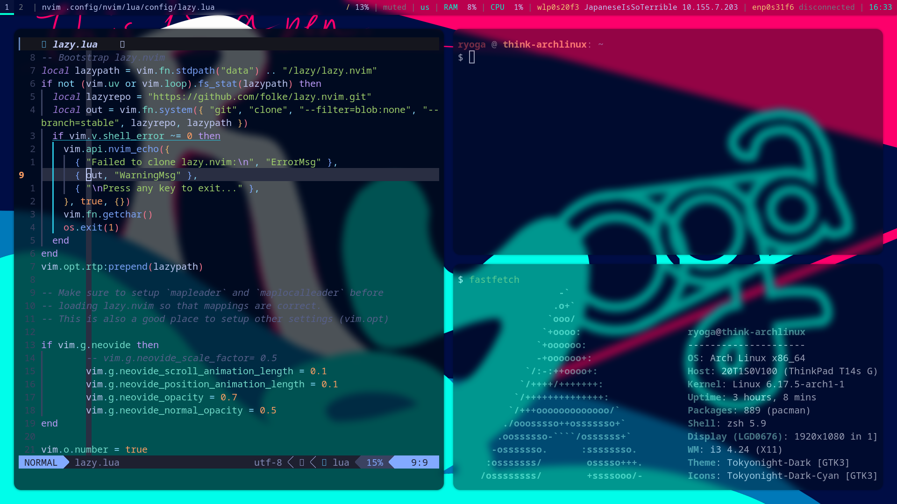

# My Personal Dotfiles
This is just for my personal configuration management.
I am using Chezmoi to manage my dotfiles, so files which start with `.` are replaced with `dot_`.


## Requirements
I use Arch , and packages I have installed are written in `pkglist.txt` for packages of the official repos, and `aurlist.txt` for AUR packages.
I sometimes generate those files by executing,

```
pacman -Qqen > pkglist.txt
pacman -Qqem > aurlist.txt
```

## Setting Up
適当にやればできるんですが、以下自分が新しいPCの環境を構築するときにやる流れを書きます。
やってたことを、なんとなく思いだして書いているだけなので、真似しないでください。
1. Install Arch Linux.
2. Configure networks, etc.
3. Install packages written in `pkglist.txt`.
4. Execute `chezmoi init RyogaHC && chezmoi apply`.
5. Execute `sudo systemctl enable lightdm && sudo systemctl set-default graphical.target && reboot`.
6. Execute `sudo systemctl --user enable syncthing`, and configure properly.
7. Copy `.git-*` and `.ppng-path` from my Syncthing folder into `~`.
8. 細かいとこいろいろやる。
